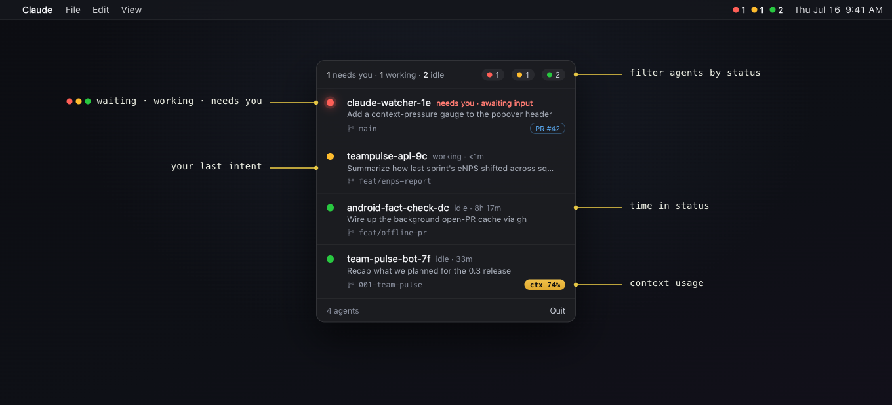

<div align="center">

# Claude Watcher

**A tiny macOS menu-bar app that tells you which Claude Code agent needs you.**

[](https://www.apple.com/macos/)
[](https://swift.org)
[](LICENSE)

🔴 needs you · 🟡 working · 🟢 idle — one glance at the menu bar, no window in your way.



</div>

## The problem

Running several Claude Code sessions at once, you lose track of **which one is
waiting on you**. Claude's own desktop notifications don't fire inside tmux, and
flipping between terminal tabs to check "is it done? is it stuck? did it ask me
something?" shreds your focus. You want an ambient signal — not another window
that steals focus.

Claude Watcher reads the status files Claude Code already writes and turns them
into one calm menu-bar indicator plus a click-to-jump panel.

## What it does

- **Per-state count in the menu bar** — `🔴1 🟡1 🟢2`, only the states that exist.
- **Real "needs you" detection** — uses Claude Code's `waiting` status, so an
  agent blocked on a prompt/permission is unmistakable (not lumped into "idle").
- **Ambient pulse** — the icon gives a gentle breathing pulse the moment a new
  agent starts needing you. No banners, no sound, no focus stealing.
- **A native SwiftUI popover** (GitHub-flavored, adapts to light/dark):
  - Each agent shows its **last intent**, **git branch**, and an **open-PR pill**.
  - **Click a row → jump straight to that agent's iTerm tab.**
  - **Click the PR pill → open the PR** in your browser.
  - **Context-pressure gauge** (`ctx 82%`) warns before the auto-compact cliff.
  - Header chips double as a **single-select filter**.
- **Real-time** via FSEvents — sub-second updates, ~0 idle CPU, no polling loop.

## How it works

```
~/.claude/sessions/*.json  ──FSEvents──▶  state  ──▶  menu bar + popover
~/.claude/projects/*.jsonl ──(on open)──▶  last intent · context · model
gh (background, cached)    ──────────────▶  open-PR status
```

Each running Claude Code process writes `~/.claude/sessions/<pid>.json`
(`name`, `cwd`, `status` = `busy`/`idle`/`waiting`, timestamps). Claude Watcher
watches that folder, drops dead PIDs (`kill(pid, 0)`), reads "last intent" and
token usage from the session transcript, and asks `gh` for PR status in the
background. Nothing leaves your machine.

## Install

### Homebrew (recommended)

```sh
brew tap AKharytonchyk/claude-watcher
brew install --cask claude-watcher
```

If Homebrew asks you to trust the tap first (a one-time prompt for third-party
casks):

```sh
brew trust --cask AKharytonchyk/claude-watcher/claude-watcher
```

Or grab `ClaudeWatcher-<version>.dmg` from
[Releases](https://github.com/AKharytonchyk/claude-watcher/releases/latest) and
drag **ClaudeWatcher.app** to Applications.

> The build isn't notarized yet, so macOS may warn on first launch. The cask
> clears the quarantine flag for you; for the DMG, right-click → Open once, or:
> `xattr -dr com.apple.quarantine /Applications/ClaudeWatcher.app`

> **On a managed / corporate Mac?** Prefer [**Build from source**](#build-from-source).
> Until the app is notarized, the cask strips Gatekeeper's quarantine flag for you —
> harmless given the code, but exactly the kind of step MDM/EDR tooling flags.
> Building locally never downloads a prebuilt binary or touches quarantine, and
> gives you the source to review first.

### Build from source

Requires the Xcode **Command Line Tools** (`xcode-select --install`). No full
Xcode needed — the UI is SwiftUI but it compiles with `swiftc` alone.

```sh
git clone https://github.com/AKharytonchyk/claude-watcher.git
cd claude-watcher
./build-app.sh        # → ClaudeWatcher.app
open ClaudeWatcher.app
```

Start at login: System Settings → General → Login Items → **+** → `ClaudeWatcher.app`.

> **First time you click a row**, macOS asks to let Claude Watcher control
> iTerm2 (for the jump-to-tab). Approve it in System Settings → Privacy &
> Security → Automation. Optional; without it, clicks reveal the folder instead.

## Configuration

| Env var | Default | Purpose |
|---------|---------|---------|
| `CWATCH_CONTEXT_WINDOW` | inferred | Force the assumed context window for the `ctx %` gauge, e.g. `1m` or `1000000`. By default it assumes 200K and upgrades to 1M once a session's usage exceeds 200K. Set this if you always run a 1M-context model. |
| `CWATCH_OFFLINE` | unset | Set to anything to disable the `gh` PR lookup — the app's only outbound network path. Guarantees zero network. |

> Set env vars for a GUI app with `launchctl setenv NAME value`, then relaunch.

## Posture

Local-first · no telemetry · no analytics · writes nothing to disk · transcripts
read-only · single `.app`, no daemon · MIT.

The app makes **no network requests of its own**. The only outbound traffic is
the optional `gh` PR lookup, which uses *your* GitHub credentials and sends only
the repo + branch — never your prompts, transcripts, or paths. Set
`CWATCH_OFFLINE` for a guaranteed zero-network run. Full details in
[PRIVACY.md](PRIVACY.md).

## Why Claude Watcher

It's deliberately **small and Claude-only**. If you want a full multi-agent
observability suite (Codex/Gemini/Aider, cost history, DORA metrics, a web
dashboard), [**Irrlicht**](https://github.com/ingo-eichhorst/Irrlicht) is
excellent and far more featureful. Claude Watcher trades all that for:

- **One file, no daemon** — a single SwiftUI binary you build in seconds.
- **Jump to the agent** — click a row and you're in its iTerm tab. (Most
  monitors show you state but can't take you there.)
- **PR-aware** — see and open the open PR for each session's branch.

## Roadmap

- [x] Per-state menu-bar breakdown + real `waiting` detection
- [x] Native SwiftUI popover — last intent, branch, open-PR pill, filter chips
- [x] Click a row → iTerm tab · click the PR pill → browser
- [x] Ambient "needs you" pulse (no focus steal)
- [x] Real-time via FSEvents
- [x] Context-pressure gauge
- [x] Distribution tooling — `release.sh` (DMG) + Homebrew cask ([docs](docs/DISTRIBUTION.md))
- [ ] Notarized release (needs an Apple Developer cert) + published tap
- [ ] Git-aware grouping (cluster rows by project)
- [ ] Optional per-session cost in USD

## Contributing & Security

Issues and PRs welcome — see [CONTRIBUTING.md](CONTRIBUTING.md). For anything
security-related, see [SECURITY.md](SECURITY.md). Changes are logged in
[CHANGELOG.md](CHANGELOG.md).

## License

[MIT](LICENSE) © Artsiom Kharytonchyk
